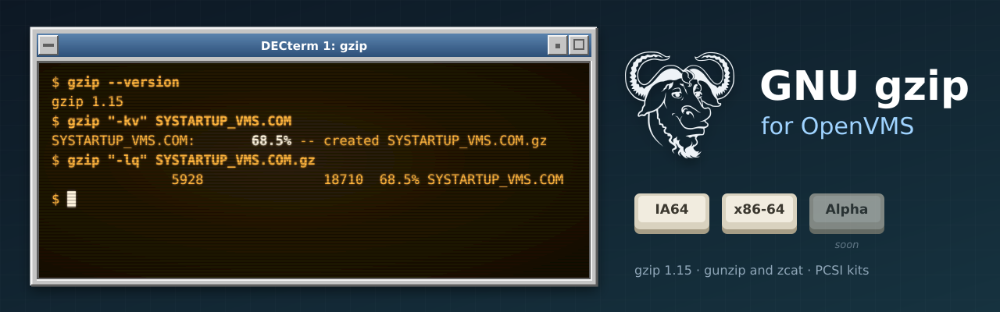

<p align="center">
  
</p>

# vms-gzip

GNU gzip 1.15 for OpenVMS (IA64 and x86-64), built natively with VSI C.

The repository stores only our changes over the signed upstream release: `patches/`
(changes to upstream files, applied in `patches/series` order) and `overlay/` (new files:
VMS build procedures, C RTL shims, PCSI kit, smoke test). `tools/prepare.sh` combines them
with the tarball into `staging/`, which is pushed to a VMS node and built there with MMS.

## Status

| Step | IA64 (V8.4-2L3) | x86-64 (E9.2-4) |
|------|-----------------|-----------------|
| Build (`tools/build.sh`) | clean | clean |
| DCL smoke test, 25 checks (`tools/test.sh`) | 25/25 | 25/25 |
| PCSI kit `ISSINOHO <base> GZIP V1.15-0E1` (`tools/kit.sh`) | built | built |
| Install check (`tools/installcheck.sh`): install, smoke 25/25, clean removal | pass | pass |

`gzip -l` output for a VMS text file matches Linux gzip byte for byte (records become
LF-terminated lines). See `docs/TESTING.md` for what the smoke test covers.

## Workflow

```sh
cp tools/nodes.conf.example tools/nodes.conf   # then fill in the real nodes
tools/prepare.sh                               # fetch, verify, patch, configure, stage
tools/build.sh <ia64|x86> [ALL|CLEAN]          # push staging/ and build with MMS
tools/test.sh <node>                           # DCL smoke test
tools/kit.sh <node>                            # PCSI kit -> out/kits/
tools/installcheck.sh <node>                   # install kit, smoke-test it, remove (changes the system)
tools/vms_configure.sh <node>                  # once per upstream release: configure with VSI C
```

## VMS changes

| Patch / file | Why |
|---|---|
| `0001-getprogname-vms` | gnulib `getprogname()` from the image name (`JPI$_IMAGNAME`) |
| `0002-stdlib-vms-exit-severity` + `vms/vms_exit.c` | failures have error severity under DCL; `$?` stays POSIX under GNV |
| `0003-config-h-assert-guard-vms` | VSI C `<assert.h>` include guard defeats gnulib's re-include |
| `0004-gzip-open-directory-vms` | `-r`: the C RTL cannot `open()` a directory; VMS-syntax directories (`[.dir]`) list VMS-form names |
| `0005-stdio-fwrite-records-vms` + `vms/vms_fwrite.c` | each `fwrite()` item became a record on record-oriented output |
| `0006-gzip-program-name-vms` | messages said `GZIP.EXE:`; now `gzip:` (and `gunzip`/`zcat` images work by name) |
| `NO_SIZE_CHECK` (`ccflags.txt`) | `st_size` of a record file counts record overhead, so every text file warned "file size changed while zipping" |
| `vms/vms_crtl_init.c` | DECC$ features: ODS-5 names, Unix name reporting, argument case |

Known limits (also in the kit's README.VMS): `.gz` keeps no VMS file attributes, so binary
files come back as Stream_LF and need `SET FILE/ATTRIBUTES`; `>` on the command line is not
handled by the C RTL (use `PIPE`); the `z*` shell scripts are not shipped.
